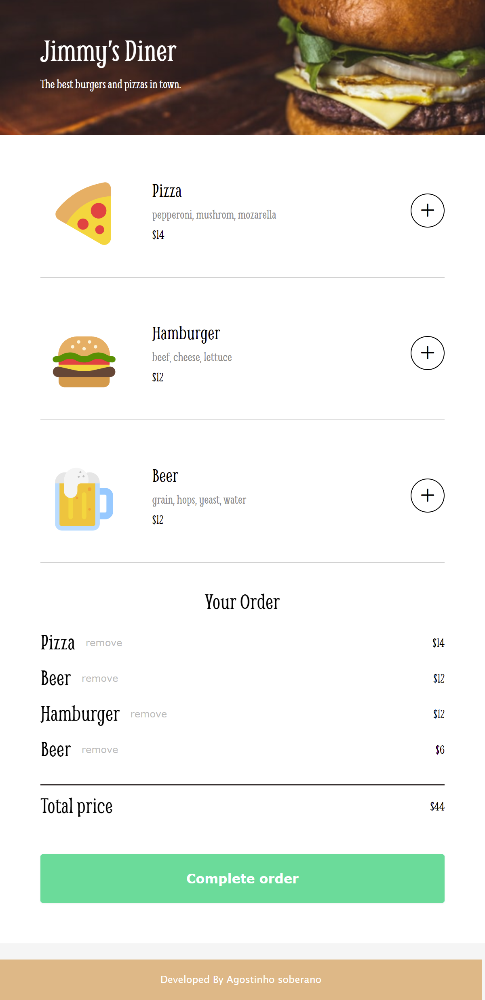
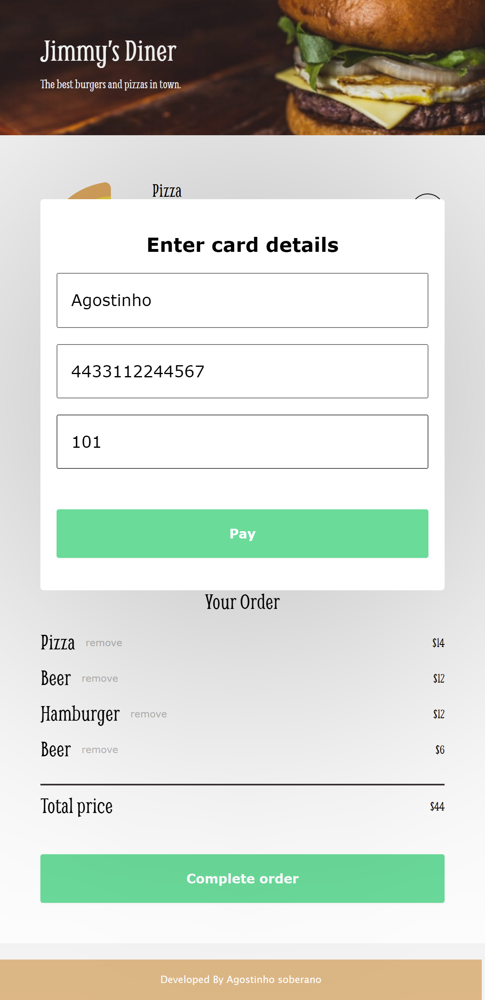
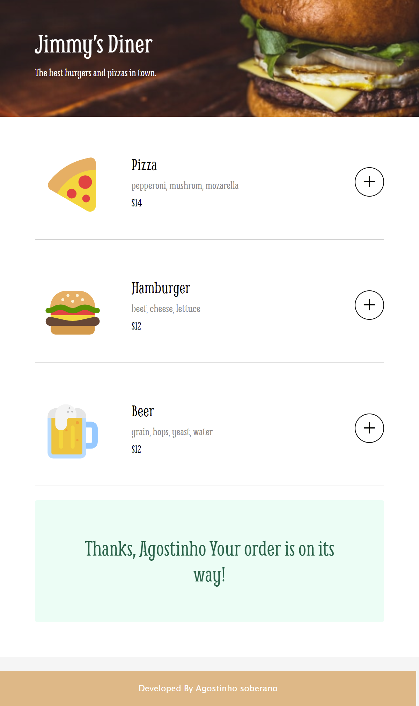

# Scrimba - Restaurant Ordering App

This is a solution to the Restaurant Ordering App. Scrimba Pro challenges help you improve your coding skills by building realistic projects.

## Table of contents

- [Overview](#overview)
  - [The challenge](#the-challenge)
  - [Screenshot](#screenshot)
  - [Links](#links)
- [My process](#my-process)
  - [Built with](#built-with)

## Overview

### The challenge

Requirements:

- Render the menu options using Javascript
- User should be able to add/remove items
- Have a payment modal with compulsory form inpust
- Upvote and downvote comments
- **Bonus**: Offer a "a meal " discount

### Screenshot

### Links

- Live Site URL: [Click here](https://rainbow-gaufre-ef630a.netlify.app/)

## My process

### Built with

- HTML5
- CSS
- Flexbox
- Javascript
